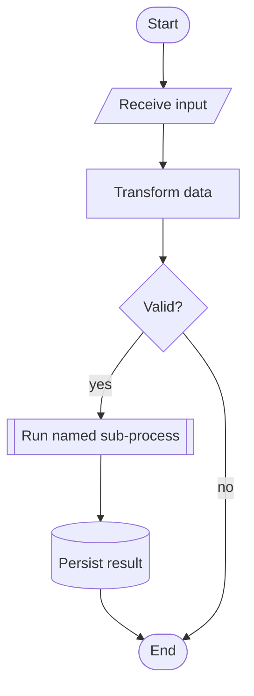

# Flowchart Notation And Quality

Use this reference when creating, revising, or reviewing flowcharts. The shape meanings are based on common ANSI/ISO flowchart conventions summarized by Wikipedia's flowchart article.

## Standard Shape Meanings

| Concept | Use for | Common shape |
| --- | --- | --- |
| Terminal | Start, end, entry, exit, trigger, or completed sub-process | Oval, stadium, or rounded rectangle |
| Process | Action that changes state, data, ownership, or position | Rectangle |
| Decision | Conditional branch, usually a question or test | Diamond |
| Input/output | Receiving data, emitting data, submitting a request, returning a result | Parallelogram |
| Predefined process | Named routine, module, playbook, or process expanded elsewhere | Rectangle with double vertical sides |
| Connector | Continuation that avoids long or crossing edges on the same page | Small labeled circle |
| Off-page connector | Continuation in another diagram or page | Labeled pentagon |
| Data store | Database, file, queue, cache, index, durable state | Cylinder |
| Document | Human-readable document, report, ticket, form, spec, output artifact | Rectangle with wavy base if supported |
| Manual operation | Human-only operation or manual adjustment | Trapezoid |
| Manual input | Human-entered input | Slanted-top quadrilateral if supported |
| Preparation | Setup, initialization, configuration, batching, precondition | Hexagon |
| Fork/join | Parallel branches and their rejoin point | Thick bar or paired parallel lines |
| Swimlane | Responsibility boundary by team, actor, system, or phase | Horizontal or vertical lane |

## Shape Mapping Rules

- Choose shapes from semantics, not aesthetics.
- Keep a shape's meaning stable across the artifact.
- Use color as a secondary cue only. The diagram must still work in grayscale.
- Use a legend only for non-obvious mappings. Keep it compact and put it after or beside the diagram.
- If the renderer cannot draw a desired standard shape, use the closest supported shape and name the semantic role in the label or legend.
- Avoid inventing decorative shapes. If the distinction does not help the reader, use a normal process rectangle.

## Mermaid Guidance

Prefer Mermaid for Markdown or source-controlled diagrams when the target renderer supports it.

Basic portable shapes:

Practical notes:

- Quote or simplify labels that contain punctuation if the renderer is strict.
- Avoid reserved-looking node ids such as `call`, `class`, `default`, or `end`.
- Use stable node ids that describe role, not label text.
- Prefer `TD` for step-by-step workflows and `LR` for compact pipelines. Switch orientation when readability suffers.
- Newer Mermaid shape syntax is not always supported everywhere. Test in the actual target renderer before relying on extended shapes.

## Readability Rules

- One diagram should answer one main question.
- Show the happy path clearly, then add exception paths without overpowering it.
- Put rare failures, retries, cleanup, and internals in supporting diagrams when they make the main flow hard to read.
- Keep labels short. Use surrounding prose for detailed explanation.
- Label all non-obvious edges and all decision exits.
- Group repeated or low-value implementation details into a predefined process.
- Use swimlanes when responsibility matters more than sequence alone.
- Use connectors when the alternative is a spaghetti edge.
- Keep visual styling quiet: restrained colors, consistent line weights, no decorative gradients, no oversized legend.

## Source, Certainty, And Change

Use the same flowcharting method for existing workflows, proposals, decisions, and hybrid artifacts. The difference is evidence posture, not diagram type.

Choose one of these patterns:

- Baseline and proposed diagrams side by side when the change is structural.
- One diagram with explicit delta markers when the starting state is already known.
- Overview plus focused mechanism diagrams when the flow has multiple independent moving parts.
- A single confirmed flow when the goal is simply to document how something works.

Make sure the chart shows:

- what triggers the process;
- what changes state;
- which actor or system owns each step;
- where decisions are made;
- what new risks, validations, waits, or fallbacks exist;
- what final outcomes are possible.

Quality rules:

- Inspect source code, docs, logs, traces, screenshots, API calls, runtime behavior, requirements, or proposal text before drawing.
- Distinguish confirmed behavior from inferred or proposed behavior when the reader could otherwise mistake one for the other.
- Do not force unrelated components into a shared template just because the diagrams need to compare them.
- Use separate diagrams when systems or alternatives have genuinely different control flow.
- When comparing variants, verify that variant-specific labels, notes, and branches only appear in the matching variant.

## Rendered QA Checklist

Before delivery, verify the actual rendered artifact:

- The diagram has a clear start, end, and main path.
- Decision branches are labeled and recombine only when that is truly the behavior.
- Text is readable at the expected viewport, page size, or slide size.
- No node text overlaps, truncates badly, or escapes its shape.
- No shape is so small that its semantic difference is invisible.
- No page-level horizontal overflow appears on mobile or narrow viewports.
- No internal scroll area hides the main point unless an intentional large-canvas interaction is provided.
- Mermaid or diagram tooling reports no parse or render errors.
- Supporting diagrams add clarity instead of repeating the same overview.
- The chart teaches the workflow faster than prose alone.
